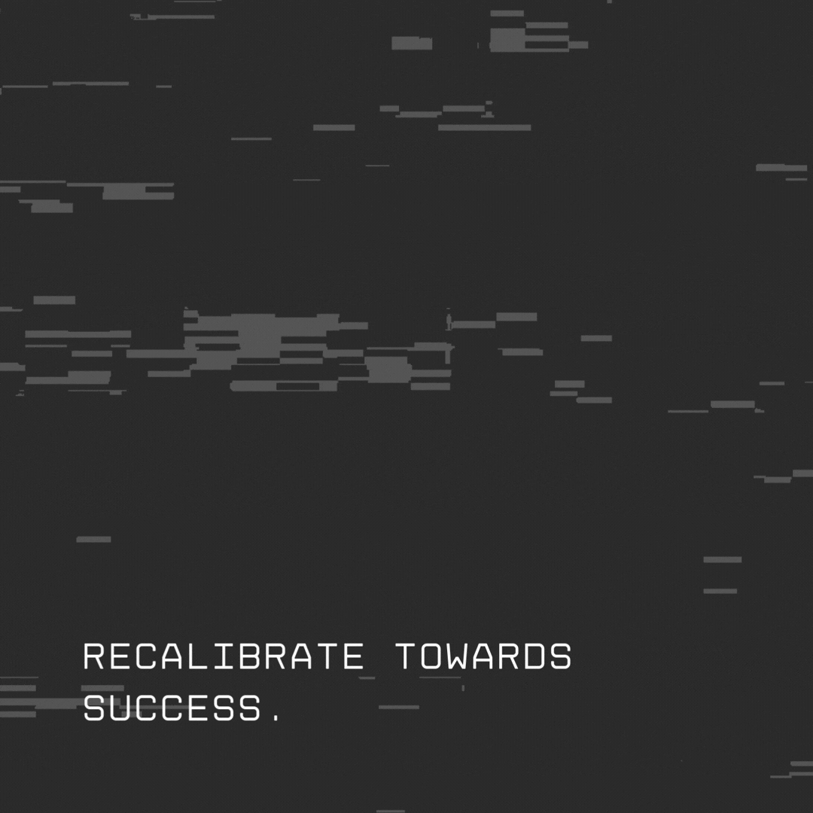

<header>
  <link rel="stylesheet" type='text/css' href="https://cdn.jsdelivr.net/gh/devicons/devicon@latest/devicon.min.css" />
</header>

 

 
  
**GIF loading a little slow? You can drink a cup of ☕ first**.
  

 

> My best project done yet
<table align="center" style="border: none; background: transparent;">
  <tr style="border: none; background: transparent;">
    <td valign="middle" padding-left="150px" padding-right="150px" style="border: none;" >
      <strong>My best project done yet</strong>
    </td>
    <td valign="middle" style="border: none; padding-top: 6px; padding-bottom: -6px;">
      
    </td>
  </tr>
</table>

 
 

### **Having Fun With👨🏽‍💻**

 

  

 

 

> “I think it is inevitable that people program poorly. Training will not substantially help matters. We have to learn to live with it.”— Alan Perlis

### **Visitor Count**

<i>Follow me around the web:</i> 

